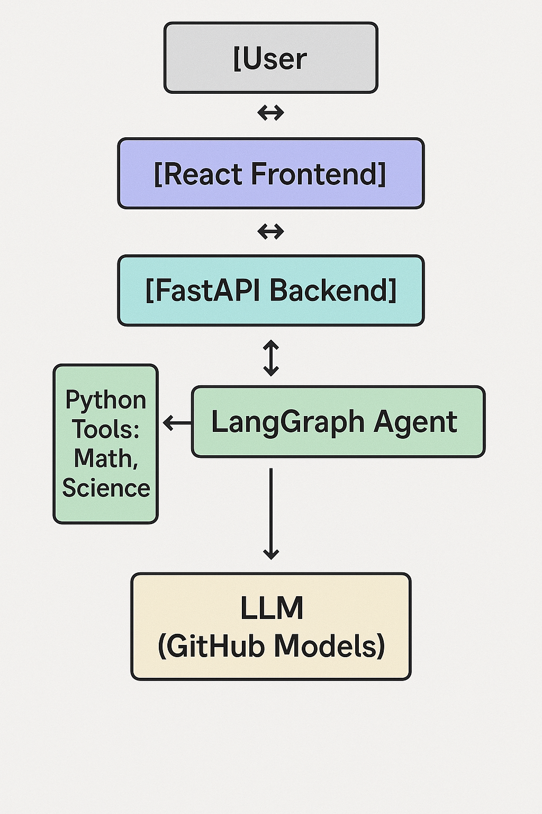

# STEMnity AI Architecture

## Overview

STEMnity AI implements a modern, layered architecture designed for scalability, maintainability, and educational effectiveness. The system follows a client-server model with specialized components for AI reasoning and STEM problem-solving.



```
[User] ⇄ [React Frontend] ⇄ [FastAPI Backend] ⇄ [LangGraph Agent]
                                         ⇓
                              [Python Tools: Math, Science]
                                         ⇓
                                 [LLM (GitHub Models)]
```

## Component Details

### 1. User Interface Layer

- **React Frontend**
  - Built with React and Vite for optimal performance
  - Uses better-react-mathjax for LaTeX math rendering
  - Implements real-time chat interface with typing indicators
  - Manages session state and conversation history
  - Provides error boundaries for robust error handling
  - Features responsive design for all device sizes

### 2. API Layer

- **FastAPI Backend**
  - RESTful API endpoints for chat interaction
  - CORS middleware for secure cross-origin requests
  - Input validation using Pydantic models
  - Content moderation for safe interactions
  - Session management for conversation context
  - Asynchronous request handling

### 3. Agent Layer

- **LangGraph Agent**
  - Implements ReAct (Reasoning + Acting) pattern
  - Manages conversation flow and tool selection
  - Maintains conversation memory using LangGraph
  - Structures reasoning in clear, educational steps
  - Handles multi-turn interactions effectively

### 4. Tools Layer

- **Python STEM Tools**
  - **Math Tools:**
    - Algebraic equation solver
    - Expression factorizer
    - Step-by-step solution generator
  - **Science Tools:**
    - Unit converter
    - Physical constants lookup
    - Scientific calculation utilities

### 5. Model Layer

- **GitHub Models Integration**
  - Large Language Model access via GitHub API
  - Contextual understanding of STEM concepts
  - Natural language generation for explanations
  - Educational content focus

## Data Flow

1. **User Input**

   - User sends question through React frontend
   - Request includes session ID for context

2. **Backend Processing**

   - FastAPI validates and moderates input
   - Routes request to LangGraph Agent

3. **Agent Processing**

   - Agent analyzes question using ReAct pattern
   - Decides whether to:
     - Use Python tools for calculations
     - Query LLM for explanations
     - Combine both for comprehensive response

4. **Tool Integration**

   - Agent calls appropriate STEM tools
   - Tools perform calculations/conversions
   - Results feed back to agent

5. **Response Generation**

   - Agent formulates educational response
   - Includes step-by-step explanations
   - Formats math using LaTeX

6. **User Presentation**
   - Frontend renders response with MathJax
   - Updates chat history
   - Maintains conversation flow

## Security Considerations

- Environment variables for sensitive configuration
- CORS protection for API endpoints
- Input validation and sanitization
- Content moderation for safe interactions
- Session-based conversation tracking

## Performance Features

- Asynchronous API handling
- Efficient React component rendering
- Optimized math rendering
- Responsive UI design
- Error recovery mechanisms

## Future Extensibility

The architecture is designed to be extensible in several ways:

1. Additional STEM tools can be easily integrated
2. New model providers can be swapped in
3. More educational features can be added
4. Analytics and monitoring can be implemented
5. User authentication can be added

## Development Setup

See the main README.md for setup instructions and requirements.
